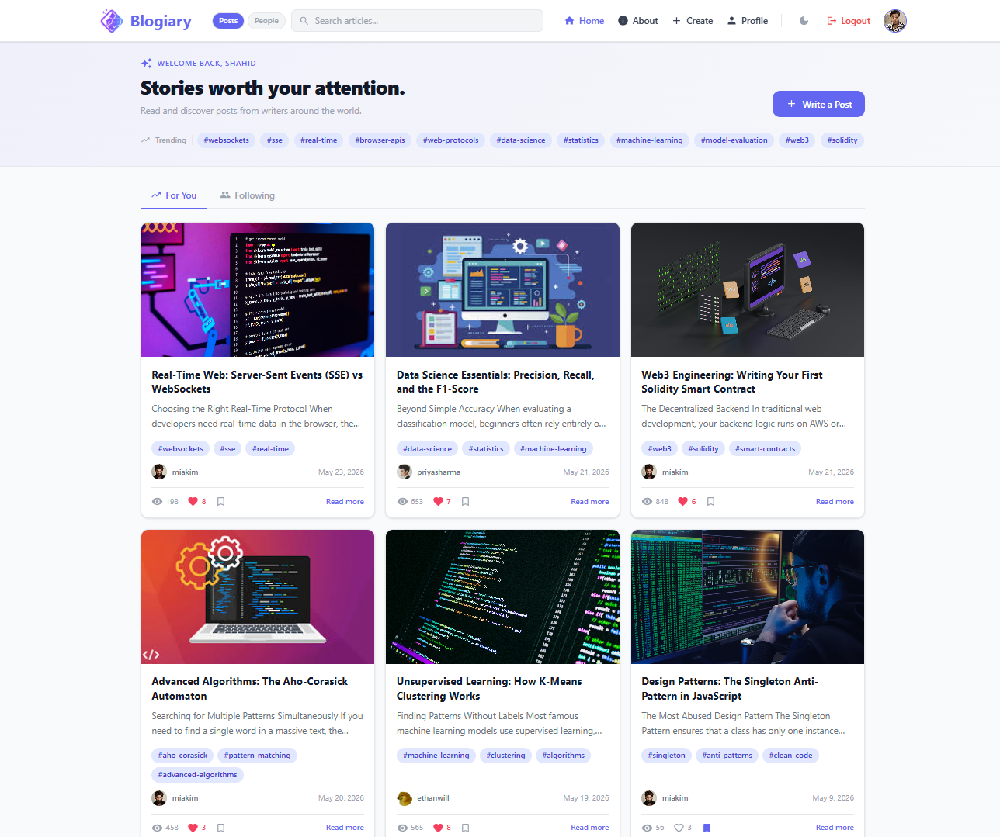
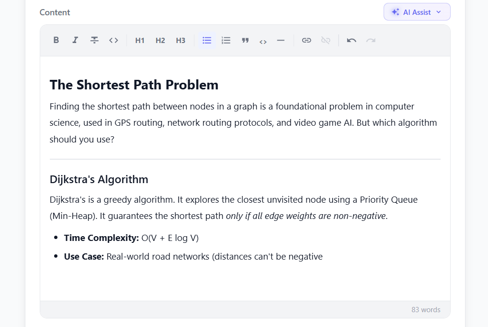
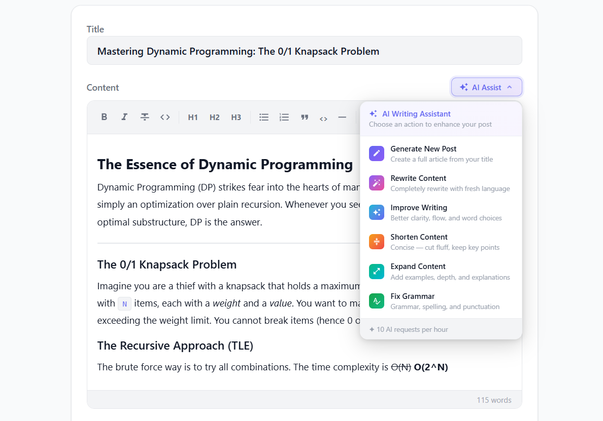
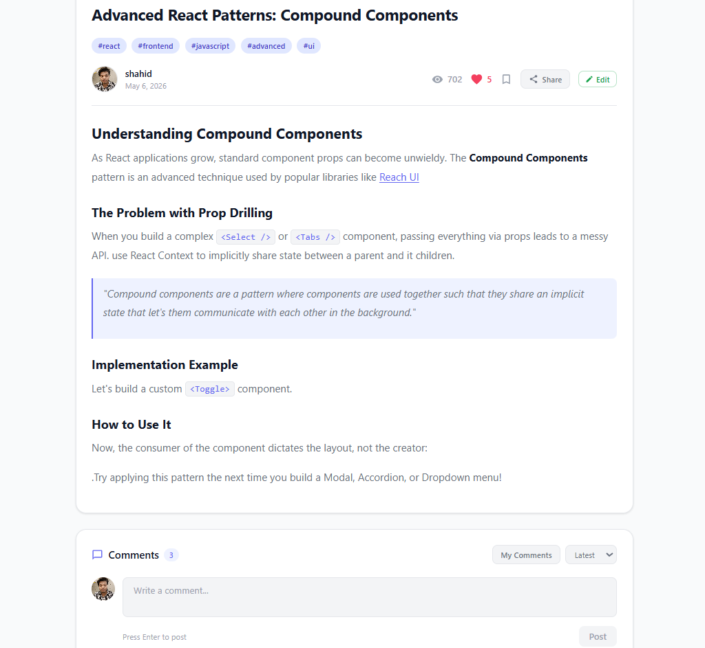
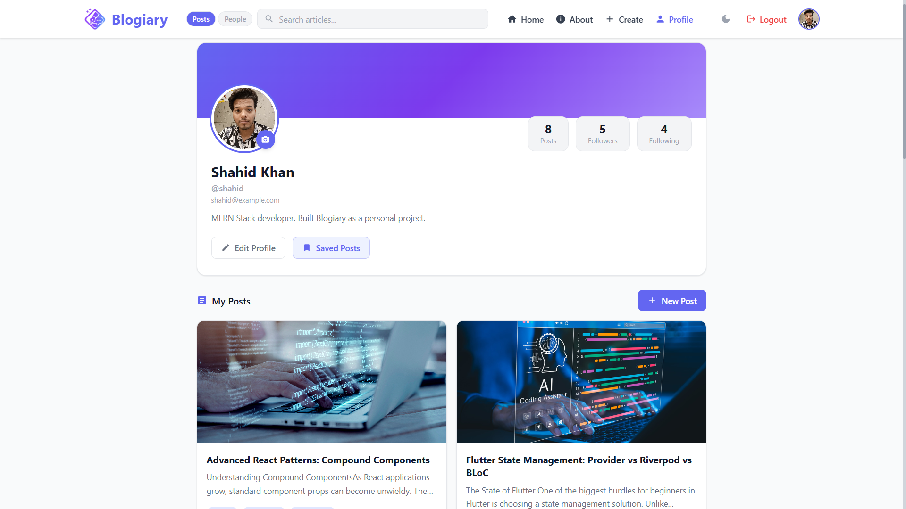

# ✍️ Blogiary

<p align="center">
  
</p>

<h3 align="center">A Next-Generation Social Blogging Platform</h3>

<p align="center">
  Where developers write, share, and discover stories—supercharged with an advanced AI assist!
  <br />
  <br />
  <a href="https://blogiary-shahidx05.vercel.app"><strong>🌐 View Live Demo »</strong></a>
</p>

---

## 📖 About The Project

Blogiary is not just another blogging platform—it's a complete ecosystem designed for creators, writers, and developers. Traditional blogging tools often lack modern social features or require third-party plugins for intelligent writing assistance. 

Blogiary solves this by natively integrating a powerful social graph (followers, feeds, bookmarks, and comments) alongside an **intelligent AI writing assistant**. Whether you are suffering from writer's block or just need to clean up your grammar, the integrated AI is right there within the editor to help you craft the perfect post.

---

## ✨ Features

**Core Platform**
- **Robust Authentication** — JWT-based secure login and registration.
- **Rich Text Editor** — Tiptap-powered editor for seamless formatting, linking, and embedding.
- **Social Graph** — Follow and unfollow users. Curated "For You" and "Following" feeds.
- **Engagement System** — Like, bookmark, and comment on stories to build community.
- **Search & Discovery** — Debounced real-time search across titles and content, plus tag-based filtering.

**AI-Powered Assist**
- **Generate & Rewrite** — Overcome writer's block instantly.
- **Tone & Length Adjustments** — Make it longer, shorter, or fix grammar seamlessly.
- **Smart Gateway** — Integrated OpenRouter fallback (StepFun/Nemotron) ensuring high availability.
- **Clean Output** — Intelligent Markdown-to-HTML sanitization for seamless Tiptap integration.

**Performance & Security**
- **Rate Limiting** — Production-grade middleware protecting APIs from abuse.
- **XSS Protection** — Aggressive HTML sanitization on all post content.
- **Cloud Storage** — Scalable image and avatar uploads via Cloudinary.
- **Responsive & Accessible** — Polished UI supporting light/dark modes on any device.

---

## 📸 Screenshots

### 1. Home Feed

*A personalized, distraction-free reading experience.*

### 2. Rich Text Editor

*Focus on writing with a clean, responsive Tiptap editor.*

### 3. AI Assist in Action

*Highlight text to automatically generate, expand, or fix grammar.*

### 4. Post Details & Engagement

*Like, bookmark, and leave comments.*

### 5. User Profile (Placeholder - Add your image here)

*View follower counts, published posts, and manage your content.*

---

## 🛠 Tech Stack

**Frontend**
<br>


**Backend**
<br>


**AI, Services & Hosting**
<br>


---

## 🔬 Deep Dive: System Architecture

### 🧠 The AI Engine (OpenRouter Integration)
The platform uses an intelligent backend controller that processes all text transformations. Instead of relying on a single point of failure, Blogiary uses an **OpenRouter Gateway**. 
- **Primary Model**: StepFun's `Step-3.5-Flash` is used for ultra-fast, high-quality generation.
- **Fallback Model**: In the event of network lag or rate-limiting, the system automatically falls back to NVIDIA's `Nemotron-Nano-9B`.
- **Sanitization Pipeline**: All AI responses are passed through a regex-based HTML cleaner that strips markdown wrappers (like ` ```html `) before returning raw HTML directly into the TipTap Editor schema.

### 👥 The Social Engine
- **Following System**: Users can follow/unfollow each other, populating a custom `Following` feed alongside the global `For You` feed.
- **Interaction Data**: Likes and Bookmarks are handled via optimistic UI updates on the frontend while securely validating state against the MongoDB backend.
- **Reading Time Calculation**: Every post calculates its reading time dynamically based on standard 200 WPM reading speeds before saving to the database.

---

## 🗄️ Data Models

At the core of the database, Blogiary relies on three main Mongoose schemas:

1. **User**: Stores authentication details, Cloudinary avatar URLs, arrays of `followers`, `following`, and `bookmarks`.
2. **Post**: Stores the TipTap HTML content, cover image, read time, view counter, arrays of `likes`, and references to the author.
3. **Comment**: References the parent `Post` and the `User` who authored the comment, along with timestamps for chronologically sorting discussions.

---

## 🚀 Run Locally

### Prerequisites
- **Node.js** v18+
- **MongoDB Atlas** account (or local MongoDB instance)
- **Cloudinary** account (for image hosting)
- **OpenRouter** API key (for AI features)

### Backend Setup

```bash
cd backend
npm install
cp .env.example .env
```

**Environment Variables (`backend/.env`):**
| Variable | Description |
|----------|-------------|
| `PORT` | API Port (e.g., 3000) |
| `MONGO_URI` | Your MongoDB connection string |
| `JWT_SECRET` | Secure key for signing auth tokens |
| `CLIENT_URL` | Frontend URL for CORS (e.g., http://localhost:5173) |
| `CLOUDINARY_*` | Keys for handling avatar and cover image uploads |
| `OPENROUTER_API_KEY` | Your OpenRouter key to power the AI assist |

```bash
npm run dev
```

### Frontend Setup

```bash
cd frontend
npm install
cp .env.example .env
```

**Environment Variables (`frontend/.env`):**
| Variable | Description |
|----------|-------------|
| `VITE_API_URL` | URL of the backend (e.g., http://localhost:3000) |

```bash
npm run dev
```

---

## 📁 Project Architecture

```
Blogiary/
├── backend/
│   ├── controllers/      # Business logic (AI, Auth, Posts, Users)
│   ├── middleware/       # Guards (Rate limiting, JWT Auth checks)
│   ├── models/           # Mongoose schemas (User, Post, Comment)
│   ├── routes/           # API Endpoint definitions
│   └── index.js          # Server entry point
└── frontend/
    ├── src/
    │   ├── assets/       # Static media (Images, logos)
    │   ├── components/   # Reusable UI (Buttons, Cards, Modals)
    │   ├── context/      # Global State (AuthContext, ThemeContext)
    │   ├── hooks/        # Custom React hooks (useDebounce, etc.)
    │   ├── pages/        # Main Views (Landing, Editor, Feed, Profile)
    │   ├── services/     # Axios API integration layer
    │   └── utils/        # Helper functions (Time formatting, etc.)
    └── index.html
```

---

## 🔗 API Endpoints

| Method | Endpoint | Description | Auth Required |
|--------|----------|-------------|---------------|
| **Auth** | | | |
| POST | `/api/auth/register` | Register a new user account | No |
| POST | `/api/auth/login` | Authenticate and receive JWT | No |
| GET | `/api/auth/me` | Fetch currently logged in user profile | Yes |
| **Posts** | | | |
| GET | `/api/posts` | Fetch the global feed of posts | No |
| GET | `/api/posts/following` | Fetch posts strictly from followed users | Yes |
| POST | `/api/posts` | Create a new blog post | Yes |
| PUT | `/api/posts/:id` | Update an existing post | Yes |
| DELETE | `/api/posts/:id` | Remove a post permanently | Yes |
| PATCH | `/api/posts/like/:id` | Toggle like status on a post | Yes |
| **Comments** | | | |
| GET | `/api/comments/:postId` | Fetch all comments for a specific post | No |
| POST | `/api/comments/:postId` | Add a new comment | Yes |
| DELETE | `/api/comments/:id` | Remove a comment | Yes |
| **Users** | | | |
| GET | `/api/users/:username` | Fetch public profile data | No |
| PUT | `/api/users/profile` | Update profile bio/avatar | Yes |
| PATCH | `/api/users/follow/:id` | Toggle follow status | Yes |
| PATCH | `/api/users/bookmarks/:id`| Toggle post bookmark status | Yes |
| **AI** | | | |
| POST | `/api/ai/generate` | Run text through OpenRouter Gateway | Yes |

---

## 👨‍💻 Author

**Shahid Khan**

[](https://github.com/shahidx05)
[](https://linkedin.com/in/shahidx05)
[](https://x.com/shahidx_05)

---